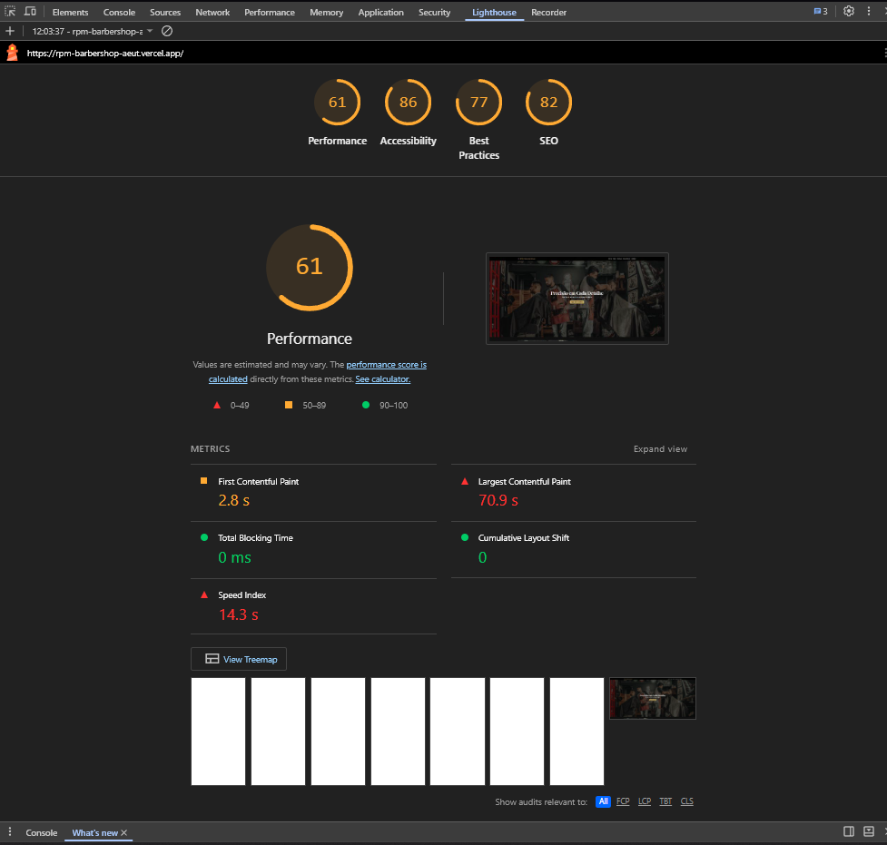
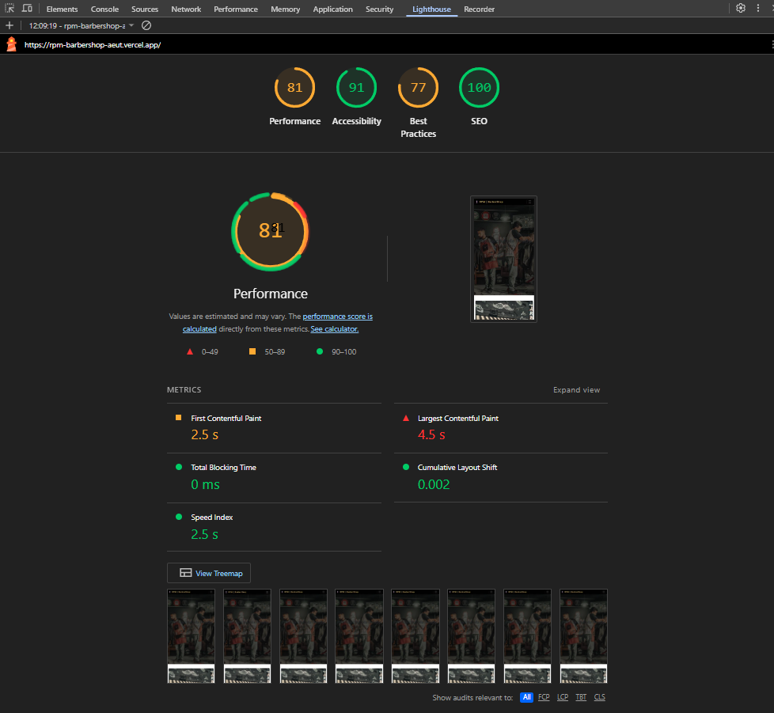

# 💈 RPM BarberShop — Atividade de Performance Web

Projeto utilizado na atividade prática de **Performance Web**, com análise e otimização de um projeto front-end existente.

## 🔗 Links

- GitHub: https://github.com/Douglas-dMelo/rpm-barbershop
- Site: https://rpm-barbershop-aeut.vercel.app/

## 🎯 Objetivo

Medir a performance do projeto com o Lighthouse, identificar gargalos, aplicar técnicas de otimização e comparar os resultados antes e depois.

## 🛠️ Tecnologias

- HTML5
- CSS3
- Bootstrap 5.3.2
- Google Fonts
- Pexels
- Vercel
- GitHub
- Chrome DevTools / Lighthouse

# 1. Análise inicial

Resultado antes das otimizações:

| Métrica | Antes |
|---|---:|
| Performance | **61** |
| Accessibility | **86** |
| Best Practices | **77** |
| SEO | **82** |
| FCP | **2,8 s** |
| LCP | **70,9 s** |
| TBT | **0 ms** |
| CLS | **0** |
| Speed Index | **14,3 s** |



## Gargalos encontrados

O principal gargalo estava relacionado ao carregamento dos recursos visuais. O LCP chegou a **70,9 s** e o Speed Index a **14,3 s**.

Também foram identificados pontos de melhoria no carregamento das imagens, organização do CSS e recursos JavaScript fornecidos pelo Bootstrap.

# 2. Otimizações aplicadas

## Imagens

As URLs de imagem passaram a utilizar entrega otimizada pelo Pexels com `fm=webp` e limites de largura (`w=240`, `w=800` e `w=1280`).

As imagens secundárias receberam:

```html
loading="lazy"
decoding="async"
```

Também foram definidos `width` e `height` para reduzir alterações de layout durante o carregamento.

A imagem principal do Hero recebeu:

```html
<link rel="preload" as="image" href="..." fetchpriority="high">
```

para priorizar o recurso que participa do conteúdo principal da primeira tela.

## CSS

O CSS que estava dentro do `index.html` foi centralizado no arquivo externo.

Foram removidos estilos não utilizados e criada uma versão minificada:

```text
style.min.css
```

O `index.html` utiliza a versão minificada do CSS.

## HTML

Foi criada também uma versão minificada do documento:

```text
index.min.html
```

A versão legível permanece em `index.html` para facilitar manutenção.

## JavaScript

O projeto não possui JavaScript próprio. O JavaScript utilizado é o bundle minificado do Bootstrap:

```text
bootstrap.bundle.min.js
```

O script é carregado com `defer` e no final do documento.

O Lighthouse apontou aproximadamente **36 KB de JavaScript não utilizado**, relacionado ao bundle do Bootstrap. Esse ponto foi documentado, mas a remoção completa exigiria substituir componentes do Bootstrap por código próprio.

# 3. Reanálise

Resultado depois das otimizações:

| Métrica | Antes | Depois | Variação |
|---|---:|---:|---:|
| **Performance** | 61 | **81** | **+20** |
| **Accessibility** | 86 | **91** | **+5** |
| **Best Practices** | 77 | **77** | **0** |
| **SEO** | 82 | **100** | **+18** |
| **FCP** | 2,8 s | **2,5 s** | **-0,3 s** |
| **LCP** | 70,9 s | **4,5 s** | **-66,4 s** |
| **TBT** | 0 ms | **0 ms** | manteve |
| **CLS** | 0 | **0,002** | +0,002 |
| **Speed Index** | 14,3 s | **2,5 s** | **-11,8 s** |



# 4. Impacto das melhorias

### LCP

**70,9 s → 4,5 s**

Redução aproximada de **93,7%**.

### Speed Index

**14,3 s → 2,5 s**

Redução aproximada de **82,5%**.

### Performance

**61 → 81**

Ganho de **20 pontos**.

### SEO

**82 → 100**

Ganho de **18 pontos**, atingindo a pontuação máxima no segundo teste.

# 5. Conclusão

A principal melhoria foi obtida através da otimização do carregamento das imagens, especialmente do conteúdo visual principal da primeira tela.

A utilização de entrega em WebP, dimensionamento das imagens, `loading="lazy"`, `decoding="async"`, `preload` e `fetchpriority="high"` reduziu significativamente o tempo necessário para apresentar o conteúdo principal.

A organização e minificação do CSS também contribuíram para uma estrutura mais adequada para produção.

O resultado final demonstrou uma evolução significativa: a Performance passou de **61 para 81**, o LCP caiu de **70,9 s para 4,5 s** e o Speed Index caiu de **14,3 s para 2,5 s**.

# 6. Estrutura da entrega

```text
rpm-barbershop/
├── index.html
├── index.min.html
├── style.css
├── style.min.css
├── img/
└── docs/
    ├── lighthouse-antes.png
    └── lighthouse-depois.png
```

## Autor

**Douglas Melo**

Projeto desenvolvido para fins acadêmicos durante o curso de desenvolvimento front-end.
